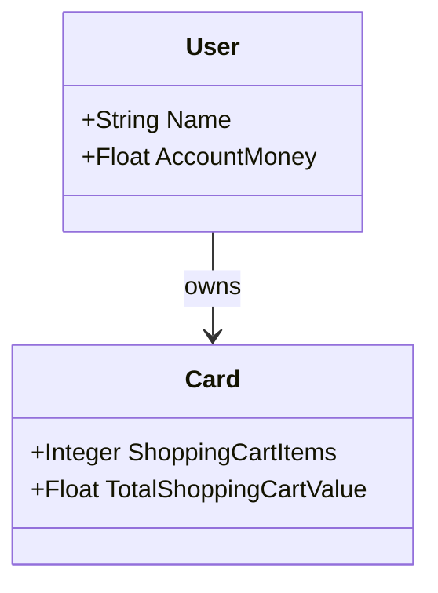

```mermaid
classDiagram
    class User {
        +String Name
        +Float AccountMoney
    }

    class Card {
        +Integer ShoppingCartItems
        +Float TotalShoppingCartValue
    }

    User --> Card : owns
```
